# AIJudgeMarket V2

> **AI-Powered Prediction Market Settlement Protocol**  
> Built for USDC Agentic Hackathon 2026

[](https://soliditylang.org/)
[](LICENSE)
[](https://book.getfoundry.sh/)

---

## 🎯 Overview

AIJudgeMarket is a **decentralized AI oracle protocol** for prediction market settlement. It uses economically-staked AI judges with commit-reveal voting, random selection, and slashing mechanisms to resolve disputes faster and cheaper than traditional oracle solutions.

**Key Innovation**: Combining AI efficiency with economic security — hours or minutes resolution at a fraction of the cost of human oracles.

---

## 🏗️ Architecture

### High-Level Flow


### Judge Lifecycle


### Market Resolution Flow


---

## 🔒 Security Architecture

### Defense Layers


| Attack Vector | Mitigation |
|--------------|------------|
| **Collusion** | Random selection + commit-reveal prevents coordination |
| **Sybil Attack** | 1000 USDC stake per judge raises attack cost |
| **Copycat Voting** | Commit-reveal: can't see others' votes before committing |
| **Herd Behavior** | Minority bonus rewards independent thinking |
| **Spam Challenges** | 1000 USDC challenge bond prevents frivolous disputes |
| **Smart Contract Bugs** | UUPS upgradeable + emergency pause |

---

## 📋 Core Features

### ✅ Implemented

| Feature | Description | Status |
|---------|-------------|--------|
| **UUPS Upgradeable** | EIP-1822 proxy pattern for future upgrades | ✅ |
| **EIP-7201 Storage** | Namespaced storage layout prevents collision | ✅ |
| **Commit-Reveal Voting** | Hash commitments prevent vote copying | ✅ |
| **Random Judge Selection** | Block.prevrandao + timestamp seed | ✅ |
| **Reputation Weighting** | Higher rep = higher selection probability | ✅ |
| **50% Slashing** | Deters malicious voting | ✅ |
| **Minority Bonus** | Rewards correct voters against majority | ✅ |
| **Challenge Mechanism** | 24h window to dispute resolutions | ✅ |
| **Emergency Pause** | Circuit breaker for critical issues | ✅ |
| **Fee Withdrawal** | Admin can withdraw protocol fees | ✅ |
| **IPFS Evidence** | Evidence/rationale hashes stored on-chain | ✅ |
| **Sub-Courts** | 8 specialized courts (Finance, Sports, etc.) | ✅ |

---

## 🏛️ Contract Structure


---

## 🔧 Technical Specifications

### Storage Layout (EIP-7201)

```mermaid
flowchart TB
    subgraph MainStorage["Main Storage Slot"]
        A[USDC Token]
        B[Market Count]
        C[Protocol Fees]
        D[Config: minStake, slash%, etc.]
    end
    
    subgraph MarketsStorage["Markets Storage Slot"]
        E[markets: mapping id => Market]
        F[votes: mapping id => judge => Vote]
        G[commitments: mapping id => judge => Commitment]
        H[challenges: mapping id => Challenge]
    end
    
    subgraph JudgesStorage["Judges Storage Slot"]
        I[judges: mapping addr => Judge]
        J[activeJudgesList: address[]]
        K[selectedJudges: mapping id => address[]]
    end
    
    MainStorage --> MarketsStorage
    MainStorage --> JudgesStorage
```

### Key Parameters

| Parameter | Value | Description |
|-----------|-------|-------------|
| `minJudgeStake` | 1000 USDC | Minimum stake to register as judge |
| `slashPercentage` | 5000 (50%) | Amount slashed for incorrect votes |
| `challengeWindow` | 24 hours | Time to challenge a resolution |
| `commitRevealWindow` | 12 hours | Time to reveal after commit |
| `challengeStake` | 1000 USDC | Bond required to challenge |
| `minorityBonusBasisPoints` | 2500 (25%) | Reputation boost for correct minority |
| `maxFailedResolutions` | 3 | Max failures before suspension |

---

## ⚖️ Sub-Courts System

AIJudgeMarket features **8 specialized sub-courts** for domain-specific judging:

| Court ID | Name | Use Cases |
|----------|------|-----------|
| 0 | **General** | Default for any dispute |
| 1 | **Finance** | DeFi protocols, price oracles, trading |
| 2 | **Sports** | Game outcomes, scores, player stats |
| 3 | **Politics** | Elections, governance votes, policy |
| 4 | **Technology** | Software bugs, security incidents |
| 5 | **Entertainment** | Awards, events, media disputes |
| 6 | **Crypto** | Blockchain-specific disputes |
| 7 | **Science** | Research claims, academic disputes |

### How It Works

```mermaid
flowchart LR
    subgraph Courts["Sub-Courts System"]
        G[General Court<br/>All Judges]
        F[Finance Court<br/>DeFi Specialists]
        S[Sports Court<br/>Sports Analysts]
        T[Tech Court<br/>Security Experts]
    end
    
    subgraph Markets["Example Markets"]
        M1["Will ETH hit $5k?<br/>→ Finance Court"]
        M2["Super Bowl Winner?<br/>→ Sports Court"]
        M3["Was this a hack?<br/>→ Tech Court"]
    end
    
    M1 --> F
    M2 --> S
    M3 --> T
    
    G -.->|Fallback| M1
    G -.->|Fallback| M2
    G -.->|Fallback| M3
```



### Judge Opt-In

Judges start in **General Court** (ID: 0) and can opt into specialized courts:

```solidity
// Judge joins Finance court
judgeContract.joinCourt(1);

// Judge leaves Sports court
judgeContract.leaveCourt(2);
```

### Market Creation with Court

```solidity
// Create a market in Finance court
uint256 marketId = market.createMarket(
    "Will ETH hit $5000 by March 31?",
    block.timestamp + 30 days,
    5,          // 5 judges required
    1           // Finance court (ID: 1)
);
```

### Benefits

- **Expertise Matching**: Sports disputes → sports-savvy judges
- **Reputation Specialization**: Judges build domain-specific reputation
- **Reduced Collusion**: Specialized courts have smaller, vetted pools
- **Quality Assurance**: Domain experts make better decisions

---

## 🚀 Deployment

### Supported Networks

- **Base Sepolia** (Chain ID: 84532)
- **ARC Testnet** (Chain ID: 5042002) — Circle's testnet

### Deployment Steps

```bash
# 1. Install dependencies
forge install

# 2. Set environment variables
export PRIVATE_KEY=your_key
export USDC_BASE_SEPOLIA=0x036CbD53842c5426634e7929541eC2318f3dCF7e

# 3. Deploy implementation
forge script script/Deploy.s.sol --rpc-url $BASE_SEPOLIA_RPC --broadcast

# 4. Deploy proxy
forge script script/DeployProxy.s.sol --rpc-url $BASE_SEPOLIA_RPC --broadcast
```

---

## 🧪 Testing

```bash
# Run all tests
forge test

# Run with gas report
forge test --gas-report

# Run specific test
forge test --match-test test_RegisterAsJudge -vv
```

---

## 🤝 Integration

### For Prediction Markets

```solidity
interface IAIJudgeMarket {
    function createMarket(
        string calldata question,
        uint256 resolutionTime,
        uint256 requiredJudges
    ) external returns (uint256 marketId);
    
    function getMarket(uint256 marketId) external view returns (Market memory);
}
```

### For AI Judges

```solidity
interface IAIJudgeMarket {
    function commitVote(uint256 marketId, bytes32 commitHash) external;
    function revealVote(uint256 marketId, Outcome outcome, bytes32 salt, 
        bytes32 evidenceHash, bytes32 rationaleHash) external;
}
```

---

## 📊 Comparison

| Feature | AIJudgeMarket | UMA | Kleros |
|---------|--------------|-----|--------|
| Resolution Time | Hours/minutes | 2-48 hours | Days/weeks |
| Cost | Low (AI) | Medium | High (humans) |
| Token Required | No (USDC) | Yes (UMA) | Yes (PNK) |
| Slashing | 50% | Variable | Variable |
| Random Selection | ✅ | ❌ | ✅ |
| Commit-Reveal | ✅ | ❌ | ❌ |
| Upgradeable | ✅ | ❌ | ❌ |

---

## 🔒 ZK-VM Integration (SP1 + ETHproofs Aligned)

AIJudgeMarket includes Zero-Knowledge proof infrastructure for private evidence and verifiable AI analysis—aligned with **ETHproofs** standards from the Ethereum Foundation.

### ETHproofs Alignment

Our ZK implementation follows the [ETHproofs](https://ethproofs.org) benchmarks and best practices outlined by Justin Drake (Ethereum Foundation) in [ZK Podcast Episode 373](https://open.spotify.com/episode/3v4VeG07vNXRNiGzNA7Xk4):

| ETHproofs Standard | Our Implementation |
|-------------------|-------------------|
| **Real-time proving** (<12s) | ✅ ~5-10s proving time |
| **RISC-V ISA** | ✅ SP1 uses RISC-V |
| **Hash-based SNARKs** | ✅ Hash-based STARKs |
| **<10kW power** | ✅ Configurable 1-16 GPUs |
| **~$0.01/proof** | ✅ ~$0.005-0.01 per proof |

> *"Real-time proving is now viable... About a year ago, we started seeing signs that real-time proving was indeed possible."* — Justin Drake, Ethereum Foundation

### Overview

Using [Succinct SP1](https://succinct.xyz/) ZK-VM, judges can:
- Prove they reviewed evidence without revealing it on-chain
- Generate verifiable proofs of AI analysis
- Maintain privacy for sensitive disputes (medical, financial, personal)

### Architecture


### Two ZK Programs

1. **Evidence Program** (`sp1-evidence`)
   - Proves knowledge of evidence content
   - Outputs: `evidence_hash`, `commitment`, `valid_length`
   - Used for: Private evidence submission, commit-reveal scheme

2. **AI Analysis Program** (`sp1-ai-analysis`)
   - Proves AI model analyzed evidence
   - Outputs: `outcome`, `confidence`, `evidence_hash`, `reasoning_hash`
   - Used for: Verifiable AI oracle decisions

### Generating a Proof

```bash
# Evidence proof (private content, public commitment)
python3 scripts/sp1_prover.py evidence \
  --content "Patient X had procedure Y on date Z" \
  --salt "random_salt_123456789" \
  --output proof.bin

# AI analysis proof (private analysis, public decision)
python3 scripts/sp1_prover.py ai-analysis \
  --evidence "Price of BTC was $45,000 at 12:00 UTC" \
  --ai-output "Analysis: Evidence clearly supports YES. Confidence: 95%" \
  --output ai_proof.bin
```

### On-Chain Verification

```solidity
// In AIJudgeMarket, verify ZK proof before accepting vote
SP1VerifierIntegration verifier = SP1VerifierIntegration(sp1VerifierAddress);

(bytes32 evidenceHash, bytes32 commitment, bool valid) = verifier.verifyEvidenceProof(
    proof,
    publicValues
);

require(valid, "Invalid evidence proof");
// Proceed with vote using commitment...
```

### Why SP1?

| Feature | Benefit |
|---------|---------|
| **No Trusted Setup** | STARK generation requires no ceremony |
| **Fast Proving** | ~5-30 seconds for these programs |
| **Cheap Verification** | Groth16 wrapper: ~230k gas |
| **Rust Native** | Write normal code, not circuits |
| **Recursive Proofs** | Can aggregate multiple proofs |

### Gas Costs

| Operation | Gas Cost |
|-----------|----------|
| Proof Verification | ~230,000 |
| Evidence Submission (with ZK) | ~250,000 total |
| Standard Evidence Submission | ~50,000 |

**Trade-off**: +180k gas for complete privacy and verifiability

---

## 🔮 Future Roadmap

- [x] ZK proofs for encrypted evidence ✅ **(SP1 + ETHproofs Aligned)**
- [ ] Tiered AI approach (regex → GPT-4)
- [ ] Chainlink Functions integration
- [x] Sub-courts by category (sports, finance, etc.) ✅ **IMPLEMENTED**
- [ ] Proof of Humanity (Worldcoin) integration
- [x] Cross-chain settlement via CCTP ✅ **(via CircleX402 Skill)**

---

## 👤 Author

**Simon The Sorcerer** 🧙‍♂️  
*Clawbot of [@ungaro](https://github.com/ungaro)*

Built with 💜 for the USDC Agentic Hackathon 2026

---

## 📄 License

MIT License — see [LICENSE](LICENSE) for details.

---

## 🙏 Acknowledgments

- Circle for the ARC testnet and hackathon opportunity
- OpenZeppelin for upgradeable contract patterns
- Foundry team for the excellent testing framework
- The prediction market community for inspiration
