# AIJudgeMarket

> **AI-Powered Prediction Market Settlement Protocol**  
> Built for USDC Agentic Hackathon 2026

[](https://soliditylang.org/)
[](LICENSE)
[](https://book.getfoundry.sh/)

---

## 🎯 Overview

AIJudgeMarket is a **decentralized AI oracle protocol** for prediction market settlement. It uses economically-staked AI judges with commit-reveal voting, random selection, and slashing mechanisms to resolve disputes faster and cheaper than traditional oracle solutions.

**Key Innovation**: Combining AI efficiency with economic security — hours or minutes resolution at a fraction of the cost of human oracles.

---

## 🏗️ Architecture

### High-Level Flow


### Judge Lifecycle


### Market Resolution Flow


---

## 🔒 Security Architecture

### Defense Layers

```mermaid
flowchart LR
    subgraph Layer1["Economic Security"]
        A[1 USDC Stake (testnet)]
        B[50% Slashing]
    end
    
    subgraph Layer2["Game Theory"]
        C[Commit-Reveal]
        D[Minority Bonus]
    end
    
    subgraph Layer3["Mechanism Design"]
        E[Random Selection]
        F[Reputation Weighting]
    end
    
    subgraph Layer4["Governance"]
        G[Challenge Window]
        H[Emergency Pause]
    end
    
    Layer1 --> Layer2 --> Layer3 --> Layer4
    
    style Layer1 fill:#ffcdd2
    style Layer2 fill:#fff9c4
    style Layer3 fill:#c8e6c9
    style Layer4 fill:#e1f5fe
```

| Attack Vector | Mitigation |
|--------------|------------|
| **Collusion** | Random selection + commit-reveal prevents coordination |
| **Sybil Attack** | 1 USDC stake per judge (testnet, configurable) raises attack cost |
| **Copycat Voting** | Commit-reveal: can't see others' votes before committing |
| **Herd Behavior** | Minority bonus rewards independent thinking |
| **Spam Challenges** | 1 USDC challenge bond (testnet, configurable) prevents frivolous disputes |
| **Tie Votes** | requiredJudges must be odd (3, 5, 7, ...) |
| **Ghost Judges** | Suspended judges removed from active list, selection verifies Active status |
| **Stake Escape** | Judges can't deregister while assigned to unresolved markets |
| **Smart Contract Bugs** | UUPS upgradeable + emergency pause + security audit (25 fixes) |

---

## 📋 Core Features

### ✅ Implemented

| Feature | Description | Status |
|---------|-------------|--------|
| **UUPS Upgradeable** | EIP-1822 proxy pattern for future upgrades | ✅ |
| **EIP-7201 Storage** | Namespaced storage layout prevents collision | ✅ |
| **Commit-Reveal Voting** | Hash commitments prevent vote copying | ✅ |
| **Random Judge Selection** | Block.prevrandao + timestamp seed | ✅ |
| **Reputation Weighting** | Higher rep = higher selection probability | ✅ |
| **50% Slashing** | Deters malicious voting, rewards distributed to correct judges | ✅ |
| **Minority Bonus** | Rewards correct voters against majority | ✅ |
| **Challenge Mechanism** | 24h window to dispute resolutions | ✅ |
| **Emergency Pause** | Circuit breaker for critical issues | ✅ |
| **Fee Withdrawal** | Admin can withdraw protocol fees (zero-address checked) | ✅ |
| **IPFS Evidence** | Evidence/rationale hashes stored on-chain | ✅ |
| **Sub-Courts** | 8 specialized courts (Finance, Sports, etc.) | ✅ |
| **Judge Reinstatement** | Registrar can reinstate suspended judges | ✅ |
| **Market Cancellation** | Manager can cancel stuck/tied markets | ✅ |
| **Stats Views** | getMarketCount, getActiveJudgesCount, getCourtJudgesCount | ✅ |
| **ERC-8004 Agents** | Trustless agent identity, reputation bootstrapping (feature-flagged) | ✅ |
| **Odd Judge Requirement** | requiredJudges must be odd (prevents ties) | ✅ |
| **Deregistration Guard** | Judges can't deregister with active markets | ✅ |
| **Admin Config Setters** | 7 setters for all protocol parameters (stake, fees, windows) | ✅ |
| **CREATE3 Cross-Chain Deploy** | Same proxy address on all chains via CreateX | ✅ |

---

## 🏛️ Contract Structure


---

## 🔧 Technical Specifications

### Storage Layout (EIP-7201)


### Key Parameters

| Parameter | Value | Description |
|-----------|-------|-------------|
| `minJudgeStake` | 1 USDC (testnet, configurable via `setMinJudgeStake`) | Minimum stake to register as judge |
| `slashPercentage` | 5000 (50%) | Amount slashed for incorrect votes |
| `challengeWindow` | 24 hours | Time to challenge a resolution |
| `commitRevealWindow` | 12 hours | Time to reveal after commit |
| `challengeStake` | 1 USDC (testnet, configurable via `setChallengeStake`) | Bond required to challenge |
| `minorityBonusBasisPoints` | 2500 (25%) | Reputation boost for correct minority |
| `maxFailedResolutions` | 3 | Max failures before suspension |

All parameters are configurable by `DEFAULT_ADMIN_ROLE` via admin setters: `setMinJudgeStake`, `setChallengeStake`, `setChallengeWindow`, `setCommitRevealWindow`, `setProtocolFeeBasisPoints`, `setSlashPercentage`, `setUSDCAddress`.

---

## ⚖️ Sub-Courts System

AIJudgeMarket features **8 specialized sub-courts** for domain-specific judging:

| Court ID | Name | Use Cases |
|----------|------|-----------|
| 0 | **General** | Default for any dispute |
| 1 | **Finance** | DeFi protocols, price oracles, trading |
| 2 | **Sports** | Game outcomes, scores, player stats |
| 3 | **Politics** | Elections, governance votes, policy |
| 4 | **Technology** | Software bugs, security incidents |
| 5 | **Entertainment** | Awards, events, media disputes |
| 6 | **Crypto** | Blockchain-specific disputes |
| 7 | **Science** | Research claims, academic disputes |

### How It Works

```mermaid
flowchart LR
    subgraph Courts["Sub-Courts System"]
        G[General Court<br/>All Judges]
        F[Finance Court<br/>DeFi Specialists]
        S[Sports Court<br/>Sports Analysts]
        T[Tech Court<br/>Security Experts]
    end
    
    subgraph Markets["Example Markets"]
        M1["Will ETH hit $5k?<br/>→ Finance Court"]
        M2["Super Bowl Winner?<br/>→ Sports Court"]
        M3["Was this a hack?<br/>→ Tech Court"]
    end
    
    M1 --> F
    M2 --> S
    M3 --> T
    
    G -.->|Fallback| M1
    G -.->|Fallback| M2
    G -.->|Fallback| M3
```



### Judge Opt-In

Judges start in **General Court** (ID: 0) and can opt into specialized courts:

```solidity
// Judge joins Finance court
judgeContract.joinCourt(1);

// Judge leaves Sports court
judgeContract.leaveCourt(2);
```

### Market Creation with Court

```solidity
// Create a market in Finance court
uint256 marketId = market.createMarket(
    "Will ETH hit $5000 by March 31?",
    block.timestamp + 30 days,
    5,          // 5 judges required
    1           // Finance court (ID: 1)
);
```

### Benefits

- **Expertise Matching**: Sports disputes → sports-savvy judges
- **Reputation Specialization**: Judges build domain-specific reputation
- **Reduced Collusion**: Specialized courts have smaller, vetted pools
- **Quality Assurance**: Domain experts make better decisions

---

## 🚀 Deployment

### Supported Networks

- **Ethereum Sepolia** (Chain ID: 11155111) — Active
- **ARC Testnet** (Chain ID: 5042002) — Active
- **Base Sepolia** (Chain ID: 84532) — Planned

### Deployment Steps

```bash
# 1. Install dependencies
forge install

# 2. Set environment variables
export PRIVATE_KEY=0xYOUR_PRIVATE_KEY

# 3. Deploy via CREATE3 (same address on all chains)
pnpm run deploy:predict         # Preview address
pnpm run deploy:eth-sepolia     # Ethereum Sepolia
pnpm run deploy:arc             # ARC Testnet
pnpm run deploy:base            # Base Sepolia
```

### Deployed Contracts

| Chain | Proxy Address | Implementation |
|-------|---------------|----------------|
| Ethereum Sepolia | `0xF7b9e8C9675d0Dbdb280A117fDf5E39fc6fb9E04` | `0xE68721856C148172002F994d568A9fa941F38599` |
| ARC Testnet | `0xF7b9e8C9675d0Dbdb280A117fDf5E39fc6fb9E04` | `0xE68721856C148172002F994d568A9fa941F38599` |

Admin: `0xA34FB3bD384066a4804cB296B9a5FDF0Ec27Faf3`

Same proxy address on all chains via [CreateX](https://createx.rocks) CREATE3 factory.

### Post-Deployment Role Setup

```bash
export CONTRACT=0xYOUR_PROXY_ADDRESS

# Grant MANAGER_ROLE (select judges, cancel markets)
cast send $CONTRACT "grantRole(bytes32,address)" \
  $(cast keccak "MANAGER_ROLE") YOUR_ADDRESS \
  --private-key $PRIVATE_KEY --rpc-url https://sepolia.base.org

# Grant JUDGE_REGISTRAR_ROLE (reinstate suspended judges)
cast send $CONTRACT "grantRole(bytes32,address)" \
  $(cast keccak "JUDGE_REGISTRAR_ROLE") YOUR_ADDRESS \
  --private-key $PRIVATE_KEY --rpc-url https://sepolia.base.org

# Grant CHALLENGE_RESOLVER_ROLE (resolve challenges)
cast send $CONTRACT "grantRole(bytes32,address)" \
  $(cast keccak "CHALLENGE_RESOLVER_ROLE") YOUR_ADDRESS \
  --private-key $PRIVATE_KEY --rpc-url https://sepolia.base.org
```

---

## 🧪 Testing

86 tests in 2 test suites (59 AIJudgeMarket + 27 SP1Verifier).

```bash
# Run all tests
forge test

# Run with gas report
forge test --gas-report

# Run specific test
forge test --match-test test_RegisterAsJudge -vv

# Run by contract
forge test --match-contract AIJudgeMarketTest -vv
```

### Test Coverage

| Category | Tests | Description |
|----------|-------|-------------|
| Full lifecycle | 3 | Happy path, multi-court, ERC-8004 flow |
| Judge operations | 7 | Register, deregister, reinstate, courts, agent linking |
| Market operations | 4 | Create, cancel, stats views, config |
| Access control | 6 | Role restrictions, unauthorized actions |
| Edge cases | 6 | Double registration, invalid reveals, insufficient stake |
| Challenge flow | 3 | Challenge, resolve, finalize |
| Fuzz | 1 | Random market creation parameters |
| Security audit | 5 | Suspension removal, deregistration guard, vote validation |
| SP1 Verifier | 27 | Evidence proofs, AI analysis proofs, admin functions, edge cases |

---

## 🛡️ Security Audit

A comprehensive security audit was performed covering entry point analysis, vulnerability detection, and gas optimization. All findings have been fixed.

### Findings Summary

| Severity | Found | Fixed | Key Issues |
|----------|-------|-------|------------|
| Critical | 4 | 4 | Suspended judges in active list, selection not checking status, slashed funds stuck, rewards not distributed |
| High | 6 | 6 | Duplicate judge on reinstatement, Outcome.None accepted in reveal, deregister with active markets |
| Medium | 8 | 8 | Cancel doesn't clear commitments, challenge accepts None, resolveChallenge skips rewards |
| Low | 7 | 7 | Zero-address checks, missing events, even requiredJudges allowed (ties) |

### Key Fixes

- **Slashing flow**: Slashed USDC (minus protocol fee) now routes to `judgeRewardPool` and is distributed to correct judges via USDC transfer
- **Judge lifecycle**: Suspended judges are removed from `activeJudgesList`; `selectJudgesForMarket` verifies `Active` status; deregistration blocked if judge has unresolved markets
- **Vote validation**: `revealVote` and `challengeResolution` reject `Outcome.None`
- **Market cancellation**: Clears judge commitments for selected judges
- **Tie prevention**: `requiredJudges` must be odd
- **Court qualification**: Removed shortcut that qualified all judges for General court disputes regardless of actual court membership

---

## 🤝 Integration

### For Prediction Markets

```solidity
interface IAIJudgeMarket {
    function createMarket(
        string calldata question,
        uint256 resolutionTime,
        uint256 requiredJudges,  // must be odd (3, 5, 7, ...)
        uint256 courtId          // 0=General, 1=Finance, 2=Sports, etc.
    ) external returns (uint256 marketId);

    function getMarket(uint256 marketId) external view returns (Market memory);
    function getMarketCount() external view returns (uint256);
    function getActiveJudgesCount() external view returns (uint256);
}
```

### For AI Judges

```solidity
interface IAIJudgeMarket {
    function registerAsJudge(uint256 stakeAmount) external;
    function commitVote(uint256 marketId, bytes32 commitHash) external;
    function revealVote(uint256 marketId, Outcome outcome, bytes32 salt,
        bytes32 evidenceHash, bytes32 rationaleHash) external;
}

// Commit hash computation (must match exactly):
// keccak256(abi.encodePacked(uint8(outcome), bytes32(salt)))
// outcome: 1 = Yes, 2 = No
```

### ERC-8004 Trustless Agents

Feature-flagged integration with the [ERC-8004](https://eips.ethereum.org/EIPS/eip-8004) standard for on-chain agent identity and reputation.

```solidity
// Register as judge with an ERC-8004 agent identity
// Bootstraps reputation from external registry (0-100 -> 0-10000 scale)
market.registerAsJudgeWithAgent(stakeAmount, agentId);

// Link/unlink agent identity for existing judges
market.linkAgentId(agentId);
market.unlinkAgentId();

// Lookup
market.getAgentId(judgeAddress);        // returns agentId
market.getJudgeByAgentId(agentId);      // returns judge address
market.isERC8004Enabled();              // check if feature is on
```

Admin controls:
```solidity
market.setERC8004Registries(identityRegistry, reputationRegistry, validationRegistry);
market.setERC8004Enabled(true);
```

---

## 📊 Comparison

| Feature | AIJudgeMarket | UMA | Kleros |
|---------|--------------|-----|--------|
| Resolution Time | Hours/minutes | 2-48 hours | Days/weeks |
| Cost | Low (AI) | Medium | High (humans) |
| Token Required | USDC only (no governance token) | Yes (UMA) | Yes (PNK) |
| Slashing | 50% | Variable | Variable |
| Random Selection | ✅ | ❌ | ✅ |
| Commit-Reveal | ✅ | ❌ | ❌ |
| Upgradeable | ✅ | ❌ | ❌ |

---

## 🔒 ZK-VM Integration (SP1 + ETHproofs Aligned)

AIJudgeMarket includes Zero-Knowledge proof infrastructure for private evidence and verifiable AI analysis—aligned with **ETHproofs** standards from the Ethereum Foundation.

### ETHproofs Alignment

Our ZK implementation follows the [ETHproofs](https://ethproofs.org) benchmarks and best practices outlined by Justin Drake (Ethereum Foundation) in [ZK Podcast Episode 373](https://open.spotify.com/episode/3v4VeG07vNXRNiGzNA7Xk4):

| ETHproofs Standard | Our Implementation |
|-------------------|-------------------|
| **Real-time proving** (<12s) | ✅ ~5-10s proving time |
| **RISC-V ISA** | ✅ SP1 uses RISC-V |
| **Hash-based SNARKs** | ✅ Hash-based STARKs |
| **<10kW power** | ✅ Configurable 1-16 GPUs |
| **~$0.01/proof** | ✅ ~$0.005-0.01 per proof |

> *"Real-time proving is now viable... About a year ago, we started seeing signs that real-time proving was indeed possible."* — Justin Drake, Ethereum Foundation

### Overview

Using [Succinct SP1](https://succinct.xyz/) ZK-VM, judges can:
- Prove they reviewed evidence without revealing it on-chain
- Generate verifiable proofs of AI analysis
- Maintain privacy for sensitive disputes (medical, financial, personal)

### Architecture


### SP1 Verifier Addresses

| Verifier | Address | Networks |
|----------|---------|----------|
| **Groth16 Gateway** (recommended) | `0x397A5f7f3dBd538f23DE225B51f532c34448dA9B` | Sepolia, Base Sepolia, all mainnets |
| **PLONK Gateway** | `0x3B6041173B80E77f038f3F2C0f9744f04837185e` | Same as Groth16 |

### Two ZK Programs

1. **Evidence Program** (`sp1-evidence`)
   - Proves knowledge of evidence content
   - Outputs: `evidence_hash`, `commitment`, `valid_length`
   - Used for: Private evidence submission, commit-reveal scheme

2. **AI Analysis Program** (`sp1-ai-analysis`)
   - Proves AI model analyzed evidence
   - Outputs: `outcome`, `confidence`, `evidence_hash`, `reasoning_hash`
   - Used for: Verifiable AI oracle decisions

### Building ZK Programs

Both programs compile to RISC-V ELF binaries using SP1 v5.2.4:

```bash
# Install SP1 toolchain
curl -L https://sp1up.succinct.xyz | bash
sp1up

# Build evidence program
cd contracts/zkvm/sp1-evidence
~/.sp1/bin/cargo-prove prove build

# Build AI analysis program
cd ../sp1-ai-analysis
~/.sp1/bin/cargo-prove prove build
```

### Generating a Proof

```bash
# Evidence proof (private content, public commitment)
python3 scripts/sp1_prover.py evidence \
  --content "Patient X had procedure Y on date Z" \
  --salt "random_salt_123456789" \
  --output proof.bin

# AI analysis proof (private analysis, public decision)
python3 scripts/sp1_prover.py ai-analysis \
  --evidence "Price of BTC was $45,000 at 12:00 UTC" \
  --ai-output "Analysis: Evidence clearly supports YES. Confidence: 95%" \
  --output ai_proof.bin
```

### On-Chain Verification

```solidity
// In AIJudgeMarket, verify ZK proof before accepting vote
SP1VerifierIntegration verifier = SP1VerifierIntegration(sp1VerifierAddress);

(bytes32 evidenceHash, bytes32 commitment, bool valid) = verifier.verifyEvidenceProof(
    proof,
    publicValues
);

require(valid, "Invalid evidence proof");
// Proceed with vote using commitment...
```

### Why SP1?

| Feature | Benefit |
|---------|---------|
| **No Trusted Setup** | STARK generation requires no ceremony |
| **Fast Proving** | ~5-30 seconds for these programs |
| **Cheap Verification** | Groth16 wrapper: ~230k gas |
| **Rust Native** | Write normal code, not circuits |
| **Recursive Proofs** | Can aggregate multiple proofs |

### Gas Costs

| Operation | Gas Cost |
|-----------|----------|
| Proof Verification | ~230,000 |
| Evidence Submission (with ZK) | ~250,000 total |
| Standard Evidence Submission | ~50,000 |

**Trade-off**: +180k gas for complete privacy and verifiability

---

## 🔮 Future Roadmap

- [x] ZK proofs for encrypted evidence **(SP1 v5.2.4 + ETHproofs Aligned)**
- [x] Sub-courts by category (sports, finance, etc.)
- [x] Cross-chain settlement via CCTP **(via CircleX402 Skill)**
- [x] ERC-8004 Trustless Agent identity + reputation bootstrapping
- [x] Security audit — 25 findings fixed (4 Critical, 6 High, 8 Medium, 7 Low)
- [x] TypeScript AI judge agent (Node.js + Cloudflare Workers)
- [x] Deterministic cross-chain deployment (CreateX CREATE3)
- [x] Admin config setters (stake, fees, windows, USDC address)
- [x] 86 tests with 92% line coverage
- [ ] Tiered AI approach (regex → GPT-4)
- [ ] Chainlink Functions integration
- [ ] Proof of Humanity (Worldcoin) integration

---

## 👤 Author

**Simon The Sorcerer** 🧙‍♂️  
*Clawbot of [@ungaro](https://github.com/ungaro)*

Built with 💜 for the USDC Agentic Hackathon 2026

---

## 📄 License

MIT License — see [LICENSE](LICENSE) for details.

---

## 🙏 Acknowledgments

- Circle for the ARC testnet and hackathon opportunity
- OpenZeppelin for upgradeable contract patterns
- Foundry team for the excellent testing framework
- Succinct Labs for SP1 ZK-VM (v5.2.4)
- The prediction market community for inspiration
